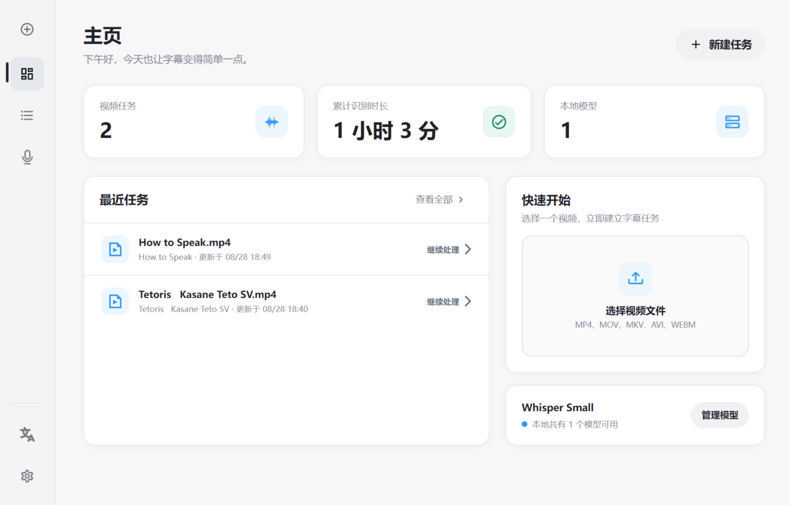
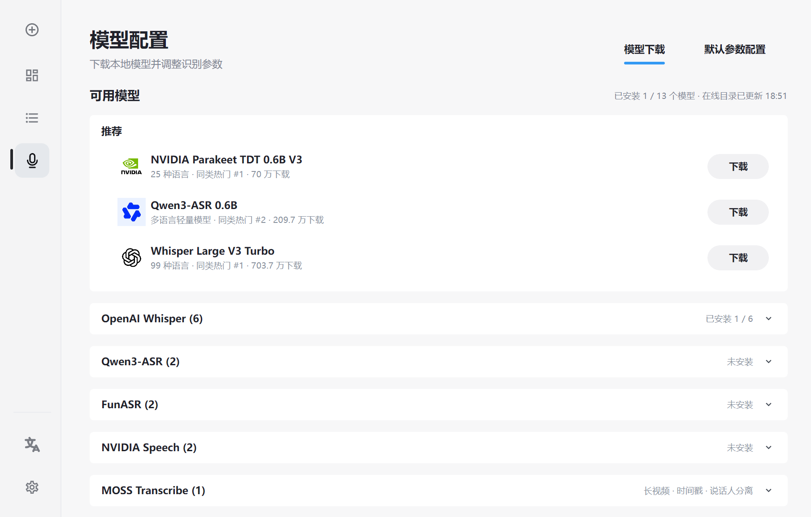
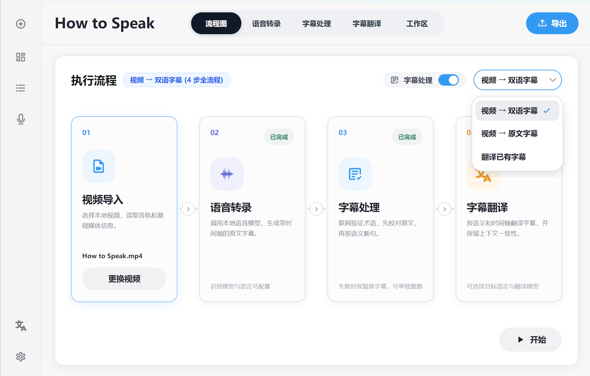
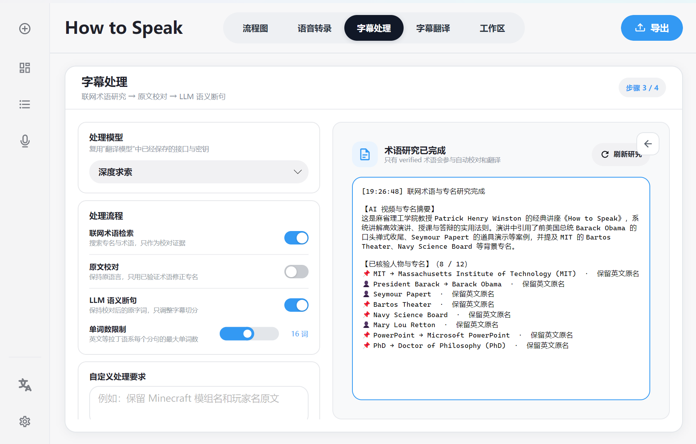
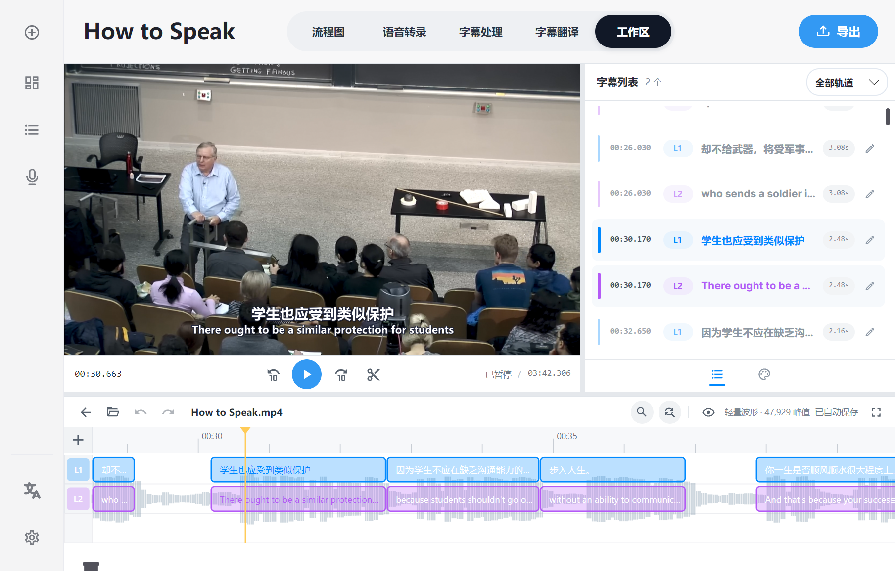
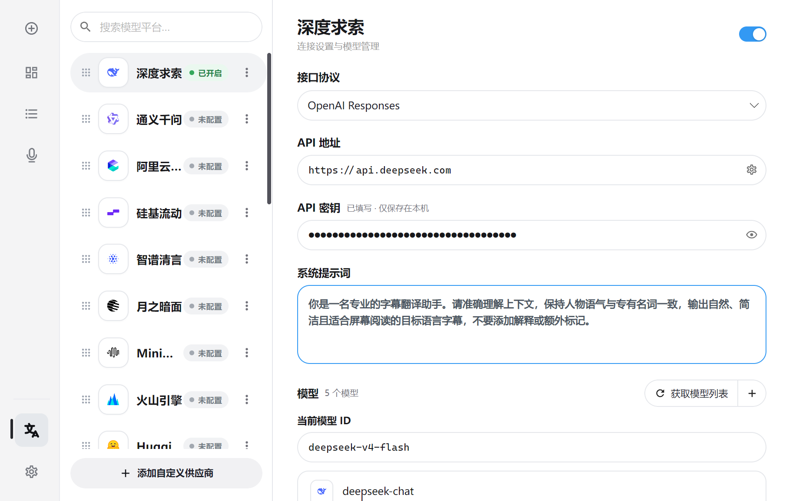
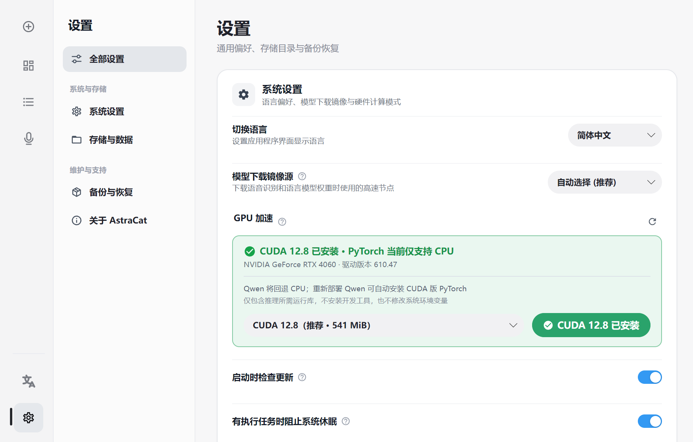
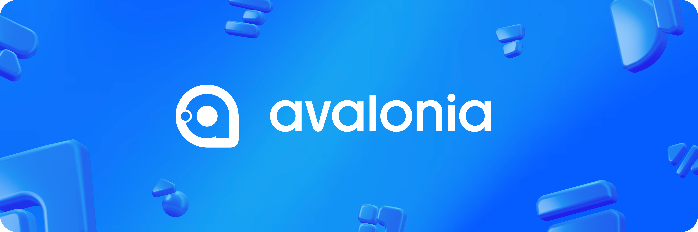

<div align="center">


# AstraCat · 小猫做字幕

**跨平台智能字幕制作工具（Windows / macOS / Linux）—— 本地语音识别、AI校对、双语翻译与多轨时间轴编辑。**

[](https://github.com/Cuptu/AstraCat)
[](https://github.com/Cuptu/AstraCat/releases)
[](https://github.com/Cuptu/AstraCat/releases)
[](https://github.com/Cuptu/AstraCat)
[](https://dotnet.microsoft.com/languages/csharp)
[](https://avaloniaui.net/)
[](https://developer.nvidia.com/cuda-toolkit)
[](./LICENSE)

[下载安装](#开始使用) · [功能介绍](#界面与功能) · [快速上手](#第一次使用) · [构建与测试](./docs/BUILDING.md) · [问题反馈](https://github.com/Cuptu/AstraCat/issues)

</div>

> [!IMPORTANT]
> **AstraCat 基于高性能 Avalonia 12.1.1 与 .NET 10 构建，支持 Native AOT 原生机器码编译与纯 C 媒体音频核心 AstraCore。Windows、macOS 与 Linux 各平台均提供一键安装原生交付包（.exe 安装程序、.dmg 镜像、.AppImage 独立运行包与 .deb 安装包），开箱即用。**

## AstraCat 是什么

AstraCat 是一款基于高性能 Avalonia 12.1.1 与 .NET 10 构建的跨平台智能字幕桌面工具。

它把本地语音识别、字幕校对、翻译、播放器和时间轴放进同一个项目里。导入一段视频或音频后，可以一路做到字幕文件或带字幕的视频；如果手里已经有 SRT，也可以直接拖进工作区继续修改。

语音识别在本机运行。翻译和字幕处理可以连接 DeepSeek、通义千问、OpenAI 兼容接口、Gemini、Claude 或本地 Ollama。云端接口不是必需项，不配置也能使用本地转录和字幕编辑。

## 它能帮你做什么

| 需要处理的内容 | 在 AstraCat 里的做法 |
|---|---|
| 视频或录音没有字幕 | 使用本地模型转录，生成带时间戳的字幕 |
| 识别结果有错字或断句不自然 | 校对原文、核对术语并重新断句 |
| 需要双语字幕 | 调用翻译接口生成译文，在双轨时间轴中继续调整 |
| 已经有媒体和 SRT | 直接拖进工作区，播放、定位并编辑字幕 |
| 字幕时间需要微调 | 在波形和多轨时间轴上拖动、裁剪、切分字幕块 |
| 需要交付字幕或成片 | 导出 SRT、ASS、TXT，或使用 FFmpeg 输出带字幕视频 |

```text
音视频 / 现有字幕 → 本地转录 → 原文处理 → 翻译 → 时间轴校对 → 字幕或视频导出
```

## 界面与功能

### 首页

首页保留最近任务、累计识别时长和本地模型状态。可以从这里新建任务，也可以直接回到上一次没有做完的项目。

### 本地语音识别

模型页负责下载模型和准备各自的运行环境。目前接入了 Whisper、Qwen3-ASR、FunASR、NVIDIA Parakeet 和 MOSS Transcribe 等后端。不同模型的参数分开保存，换项目时不用重新填写。

应用不会调用系统 Python。模型、Python 包和运行库都放在 `runtime` 下，出问题时可以单独修复，不会改动电脑上的开发环境。

转录页可以设置语言、设备、精度、VAD、分块时长、热词和模型自己的参数。连续处理多个文件时会复用已经加载的 Worker；闲置后再释放内存和显存。

<p align="center">


</p>
<p align="center"><sub>左：最近任务与模型状态　右：本地语音识别模型和运行环境</sub></p>

### 翻译接口

翻译服务在一个页面里统一管理。每个服务可以分别填写协议、地址、密钥、系统提示词和模型 ID，也可以添加自己的 OpenAI 兼容接口。

API Key 只保存在本机配置中。截图、日志和提交记录里仍然不要放真实密钥。

### 项目流程

一个项目分成语音转录、字幕处理、字幕翻译和工作区几个页面。流程图只是入口，不会把每一步绑死：可以完整跑一遍，也可以跳过字幕处理，或者直接载入现成字幕翻译。

### 字幕处理

这一页主要处理识别后的原文：

- 从字幕和文件名里找出可能的人名、地名和专业词；
- 通过 DeepSeek 联网搜索核对写法和来源；
- 只用已经确认的术语修正原文；
- 在不改原意的前提下重新断句。

联网研究失败不会覆盖原字幕。搜索结果、来源和失败原因会写进项目目录，也可以在右侧摘要中查看。该功能会使用 DeepSeek API 额度，不需要时可以关掉。

<p align="center">


</p>
<p align="center"><sub>左：项目处理流程　右：字幕修正、断句与术语研究</sub></p>

### 字幕工作区

工作区左侧是视频或音频播放器，右侧是字幕列表，下方是波形和多轨时间轴。播放位置、字幕列表和时间轴会互相跟随。

这里可以：

- 直接拖入视频、音频和 SRT；
- 播放纯音频并预览字幕；
- 修改字幕文字、开始时间和结束时间；
- 拖动、裁剪、切分、插入或删除字幕块；
- 使用多轨字幕制作双语字幕；
- 搜索、替换、撤销和重做；
- 调整字体、颜色、描边、背景和位置；
- 导出 SRT、ASS、TXT 或带字幕的视频。

<p align="center">

</p>

### GPU 与运行环境

设置页显示显卡、驱动、CUDA 运行库和当前模型环境的实际状态。电脑装了 CUDA Toolkit，不代表模型环境中的 PyTorch 或 CTranslate2 就能使用 GPU，所以 AstraCat 会分别检查它们。

应用内下载的 CUDA 运行库只放在 AstraCat 的目录里，不修改系统环境变量。GPU 环境不可用时会给出原因，并在允许的情况下退回 CPU。

<p align="center">


</p>
<p align="center"><sub>左：翻译与大模型接口　右：GPU、驱动和 CUDA 环境检测</sub></p>

## 开始使用

### 下载

在 [GitHub Releases](https://github.com/Cuptu/AstraCat/releases) 下载对应平台的原生交付包（全平台支持 Native AOT 机器码原生编译，免除 .NET 运行时依赖，极速启动）：

| 平台 | 安装包格式 | 说明 |
|---|---|---|
| **Windows (x64)** | `AstraCat-v*-Setup.exe` | 原生安装向导程序，自动创建快捷方式与文件关联 |
| **macOS (Apple Silicon)** | `AstraCat-v*-arm64.dmg` | 原生 Apple 磁盘镜像，挂载后拖拽至 Applications 即可运行 |
| **Linux (x86_64)** | `AstraCat-v*-x86_64.AppImage` | 独立免安装可执行单文件，赋予执行权限后直接双击运行 |
| **Linux (Debian / Ubuntu)** | `AstraCat-v*_amd64.deb` | 原生系统软件包，双击调起软件中心一键安装 |

所有安装程序均已内置 AstraCore 原生媒体引擎，无需用户预先安装 .NET SDK 或运行库。语音识别模型和可选 CUDA 运行库体积较大，首次使用时可在应用内按需下载。

### 第一次使用

1. 打开“模型配置”，下载一个识别模型。
2. 新建任务，导入视频或音频。
3. 在“语音转录”里选择模型、语言和设备，然后开始识别。
4. 在工作区检查文字和时间轴。
5. 导出字幕；需要成片时再选择视频导出。

如果只想编辑已有字幕，新建项目后把媒体和 SRT 直接拖进工作区即可。

## 导出格式

| 类型 | 当前支持 |
|---|---|
| 字幕 | SRT、ASS、TXT |
| 视频容器 | MP4、MOV、MKV |
| 视频编码 | H.264、HEVC、AV1 |
| 硬件编码 | NVIDIA NVENC、Intel QSV、AMD AMF |
| 分辨率 | 保持原始、常用预设或自定义 |
| 帧率 | 保持原始、24、25、30、60 FPS |

导出前会检查 FFmpeg 实际提供的编码器。硬件编码不可用或执行失败时，可以改用软件编码。

## 数据放在哪里

便携版和开发版的数据都在程序目录下的 `runtime`：

```text
runtime/
├─ cache/       可重新生成的缓存
├─ config/      应用与接口配置
├─ e/           各识别后端的 Python 环境
├─ gpu/         可选 CUDA 运行库
├─ models/      本地模型
├─ projects/    项目、字幕和自动保存
├─ python/      基础 Python 环境
└─ tools/       FFmpeg 与 libmpv
```

不要在没有备份的情况下删除 `runtime`。只想腾出构建空间时，可以删除 `bin`、`obj` 和 `dist`，它们不包含项目数据。

## 隐私和联网

- 本地转录不会上传音视频。
- 播放、时间轴编辑和本地字幕导出不需要联网。
- 模型下载需要访问模型镜像或 Hugging Face。
- 翻译、LLM 校对和术语研究会把相应文字发送给所选服务商。
- 联网术语研究会访问 DeepSeek 的 `web_search`，并消耗对应 API 额度。

使用云端接口前，请自行查看服务商的数据处理规则和计费方式。

## Avalonia 性能与底层实现

AstraCat 使用 .NET 10 和 Avalonia 12.1.1。界面、播放器、媒体工具和语音模型没有塞在同一条执行链里，而是按各自的工作方式分开：

```text
Avalonia 主进程
├─ libmpv Render API       同进程 OpenGL 视频绘制
├─ FFmpeg / FFprobe       独立进程，探测、转码和导出
└─ Python ASR Worker      常驻子进程，加载并运行语音模型
```

### 播放器与界面合成

播放器基于 `OpenGlControlBase` 实现，通过 libmpv Render API 把视频帧直接画进 Avalonia 的 OpenGL 帧缓冲。字幕、按钮和浮层仍由 Avalonia 正常绘制，不需要在界面中嵌入一个独立的视频窗口。Windows 下优先使用 ANGLE/EGL，初始化失败时 Avalonia 可以退回软件渲染。

项目默认启用 Avalonia 编译绑定，任务列表和字幕列表使用虚拟化面板，长列表只创建当前可见的项目控件。页面切换和侧栏动画使用可中断的属性过渡；隐藏区域会同步停止命中测试，避免透明控件继续接收鼠标事件。

### 时间轴为什么能处理长字幕

字幕时间轴没有为每条字幕创建一个 UI 控件，而是在 `SubtitleTimelineControl` 中用 `DrawingContext` 集中绘制。数据变化时先建立轨道索引；滚动或缩放时通过时间区间和二分查找只取当前可见的字幕块，不会每一帧从头扫描整个项目。

文字排版使用有上限的 `TextLayout` 缓存，画刷和画笔等绘图对象会复用。字幕冲突、轨道位置和边界信息也尽量在数据变化时计算，而不是在播放位置更新时重复计算。这样做主要是为了让长视频、多轨字幕和高倍率缩放下的拖动仍然跟手。

### Worker、取消与资源释放

每种语音识别后端有自己的 Python 环境，主程序通过逐行 JSON 与 Worker 通信，普通日志走标准错误流，避免污染结果。连续任务会复用已经加载的模型；超过闲置时间后再关闭 Worker，释放内存和显存。取消任务时会同时终止对应的子进程树，防止 FFmpeg 或 Python 留在后台继续运行。

FFmpeg、libmpv 和 Python 环境都从 `runtime` 解析，不依赖系统 PATH。这样便于固定发布版本，也能把某个模型环境的修复限制在自己的目录中。

## 开发构建

当前开发环境为 Windows x64，需要 [.NET 10 SDK](https://dotnet.microsoft.com/download/dotnet/10.0)。

```powershell
git clone https://github.com/Cuptu/AstraCat.git
cd AstraCat
dotnet restore --locked-mode
dotnet build -c Release --no-restore
dotnet test
python -m py_compile engines\asr_worker.py
```

Windows 开发可先下载并校验旧预编译依赖；正式发布使用统一 AstraCore：

```powershell
powershell -NoProfile -ExecutionPolicy Bypass -File .\scripts\prepare-native-deps.ps1
dotnet run -c Debug

# 或从固定提交构建共享 FFmpeg/libmpv/libass 运行时
powershell -NoProfile -ExecutionPolicy Bypass -File .\scripts\prepare-astracore-sources.ps1
powershell -NoProfile -ExecutionPolicy Bypass -File .\scripts\build-astracore.ps1
$env:ASTRACAT_MEDIA_RUNTIME = (Resolve-Path .\artifacts\astracore\win-x64).Path
dotnet run -c Debug
```

源码仓库不保存构建产物、模型、Python 环境和 CUDA 运行库。AstraCore
脚本固定 FFmpeg、mpv、libass、libplacebo 和 8-bit x265 的源码提交，生成
一套共享 ABI，并检查软件编码器、三家硬件编码入口、D3D11VA 和运行时哈希。

### 构建检查

```powershell
powershell -NoProfile -ExecutionPolicy Bypass -File .\scripts\audit-repository.ps1
dotnet build -c Release
python -m py_compile engines\asr_worker.py
```

### 打包 Windows 版本

需要先安装 Inno Setup 6，然后执行：

```powershell
powershell -NoProfile -ExecutionPolicy Bypass -File .\scripts\prepare-astracore-sources.ps1
powershell -NoProfile -ExecutionPolicy Bypass -File .\scripts\build-astracore.ps1
powershell -NoProfile -ExecutionPolicy Bypass -File .\package-release.ps1 -Version 0.1.2-DEV -AstraCoreDir .\artifacts\astracore\win-x64
```

脚本会生成：

```text
dist/AstraCat-v0.1.2-DEV-Setup.exe
dist/AstraCat-v0.1.2-DEV-win-x64.zip
dist/AstraCat-v0.1.2-DEV-SHA256.txt
```

它会检查 AstraCore 清单哈希、共享 ABI、依赖闭包、FFmpeg 功能白名单和
200 MiB 硬上限；缺少能力或混入旧版 FFmpeg/libmpv 时直接停止。

GitHub 上传范围、Actions 工作流和标签发布方法见 [构建与发布文档](./docs/BUILDING.md)。

<details>
<summary><b>项目结构</b></summary>

```text
AstraCat/
├─ Assets/                          应用图标、字体与界面视觉资产
├─ Controls/                        高性能 DrawingContext 字幕时间轴与自定义控件
├─ Models/                          字幕、样式、音频波形与工程数据模型
├─ Services/                        领域服务层架构
│  ├─ Animation/                    动效调度与 Easing 缓动曲线
│  ├─ Media/                        播放器、波形提取与媒体导出服务
│  ├─ Native/                       AstraCore C ABI 跨平台动态库载入桥
│  ├─ Workers/                      Python 隔离子进程 ASR Worker 客户端
│  └─ Workspace/                    工程事务仓储与工作区会话管理
├─ Views/                           Avalonia 界面窗口与浮层组件
├─ tests/                           自动化单元测试 (MSTest / .NET 10)
├─ native/                          纯 C 语言高性能 AstraCore 媒体音频核心源码
├─ engines/                         Python ASR Worker 常驻引擎
├─ installer/                       Windows Inno Setup 原生安装程序脚本
├─ scripts/                         全平台构建、发布打包与安全审计脚本
├─ runtime/                         本地模型、独立环境与项目持久化目录
├─ App.axaml                        应用资源与主题配置
├─ Program.cs                       程序启动入口与平台渲染上下文初始化
├─ AstraCat.slnx                    现代跨平台解决方案
├─ AstraCat.csproj                  .NET 10 / Avalonia 项目配置
└─ packages.lock.json               NuGet 依赖锁定文件
```

界面使用 Avalonia 12.1.1，播放器通过 libmpv Render API 绘制，媒体探测和导出由 FFmpeg 子进程完成，语音模型运行在独立的 Python Worker 中。

</details>

## 常见问题

<details>
<summary><b>为什么显示 CPU，明明电脑有 NVIDIA 显卡？</b></summary>

应用检查的是当前模型环境里的 PyTorch 或 CTranslate2。系统装了显卡驱动或 CUDA Toolkit，不等于这个 Python 环境装了可用的 CUDA 版本。先到设置页刷新 GPU 状态，再按提示修复对应模型环境。

</details>

<details>
<summary><b>模型下载完成后为什么还是不能使用？</b></summary>

模型权重和运行环境是两部分。权重已经下载，但 Python 包不完整或版本不匹配时，模型仍会显示不可用。可以在模型页重新部署或修复运行环境。

</details>

<details>
<summary><b>视频或纯音频无法播放怎么办？</b></summary>

先确认 `runtime/tools/mpv/libmpv-2.dll` 存在。若文件完整，更新显卡驱动后重试；仍然失败时请在 Issues 中附上系统版本、媒体格式和错误提示。

</details>

<details>
<summary><b>翻译或联网术语研究没有结果怎么办？</b></summary>

检查服务地址、API Key 和模型名称。DeepSeek 联网术语研究使用 Responses API 和 `deepseek-v4-flash`；接口超时、限流或没有返回完整 JSON 时会自动重试，并把最终原因写入术语摘要。

</details>

## 参与开发

发现问题请开 [Issue](https://github.com/Cuptu/AstraCat/issues)。如果准备提交代码，欢迎发 [Pull Request](https://github.com/Cuptu/AstraCat/pulls)。

提交前请至少完成：

1. `dotnet build -c Release`；
2. 修改 Python Worker 时运行语法检查；
3. 检查取消、失败回退和重复执行；
4. 不提交 API Key、模型、Python 环境、项目数据和构建产物。

## 鸣谢与支持

### 核心技术框架

<a href="https://avaloniaui.net/" target="_blank" rel="noopener noreferrer">
  
</a>

AstraCat 深度基于 **[Avalonia UI](https://avaloniaui.net/)** 打造现代化高性能跨平台桌面体验，在此特别向 Avalonia 核心团队及全球开源社区致以崇高敬意！

### 开源许可证支持

<a href="https://jb.gg/OpenSourceSupport" target="_blank" rel="noopener noreferrer">
  
</a>

特别感谢 **[JetBrains](https://www.jetbrains.com/?from=AstraCat)** 通过 [免费开源项目许可证计划 (Free Open Source License)](https://jb.gg/OpenSourceSupport) 为 AstraCat 核心开发团队提供专业 IDE 及全套开发工具链支持。

### 赞助商与支持者

感谢以下平台与赞助商对开源生态的大力支持：

<a href="https://www.digitalocean.com/" target="_blank" rel="noopener noreferrer">
  
</a>

### 使用的开源项目

- [Avalonia](https://avaloniaui.net/)：跨平台桌面界面框架与现代化渲染引擎
- [FFmpeg](https://ffmpeg.org/)：音视频多媒体编解码、音频探测与字幕合成烧录
- [mpv / libmpv](https://mpv.io/)：硬件加速媒体播放核心引擎
- [yt-dlp](https://github.com/yt-dlp/yt-dlp)：跨平台音视频流下载与解析
- [faster-whisper](https://github.com/SYSTRAN/faster-whisper)：高效本地 Whisper 语音推理引擎
- [PyTorch](https://pytorch.org/)：深度学习模型与语音算法运行时
- [Hugging Face](https://huggingface.co/)：开放模型目录与权重分发托管

各组件和模型遵循各自的开源许可证。发布二进制文件时，均遵守相应的再分发与署名要求。

## 许可证

原生媒体运行时的统一构建、字幕接口边界、多平台策略和 FFmpeg CLI 迁移路线见 [AstraCore media runtime](docs/ASTRACORE.md)。

AstraCat 使用 [GNU General Public License v3.0](LICENSE)，SPDX 标识为 `GPL-3.0-only`。

```text
Copyright (C) 2026 Cuptu
SPDX-License-Identifier: GPL-3.0-only
```

项目地址：<https://github.com/Cuptu/AstraCat>

## Star History

[](https://star-history.com/#Cuptu/AstraCat&Date)

